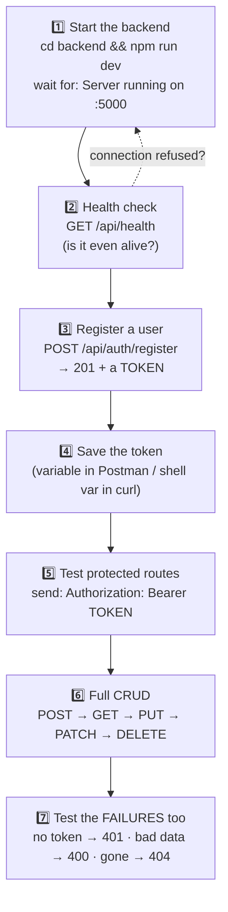
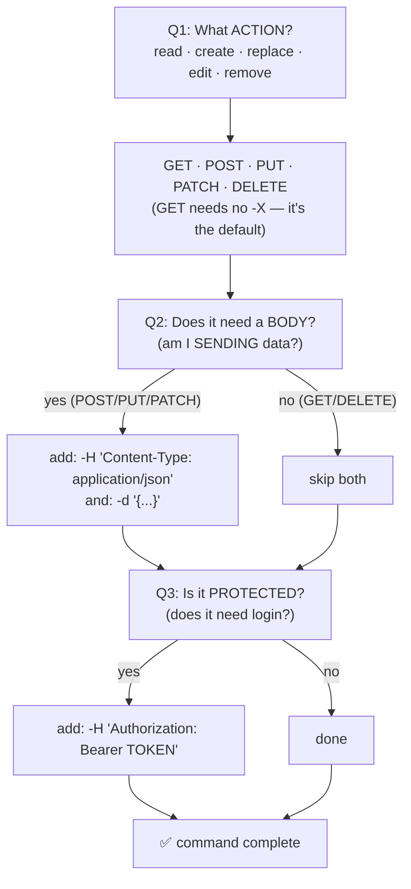

# 🧪 The API Testing Guide — curl & Postman from Zero

Companion to [BACKEND-GUIDE.md](BACKEND-GUIDE.md). That one teaches you to BUILD
the API. This one teaches you to **test it** — the skill you use every single
day as a backend developer, and the one interviewers assume you have.

Assumes **zero** knowledge. Every command here runs against THIS repo's
backend, so you can copy-paste and watch it work.

---

## Table of contents

1. [Why test APIs at all?](#1-why-test-apis-at-all)
2. [The anatomy of a request (4 parts)](#2-the-anatomy-of-a-request)
3. [Status codes — the full map](#3-status-codes--the-full-map)
4. [🗺️ The testing flow](#4-%EF%B8%8F-the-testing-flow)
5. [Part A — curl, step by step](#5-part-a--curl-step-by-step)
6. [⭐ How to BUILD any curl command yourself](#6--how-to-build-any-curl-command-yourself)
7. [Part B — Postman, click by click](#7-part-b--postman-click-by-click)
8. [The complete test run (all 7 endpoints)](#8-the-complete-test-run)
9. [Common errors & fixes](#9-common-errors--fixes)
10. [Best practices](#10-best-practices)
11. [Interview questions](#11-interview-questions)

---

## 1. Why test APIs at all?

Your backend has no screen. When you write `POST /api/items`, there's no button
to click — so how do you know it works?

You need a **client**: a program that sends HTTP requests and shows you the raw
response. Two standard ones:

| Tool | What it is | Best for |
|---|---|---|
| **curl** | a command in your terminal | quick checks, servers, scripts, CI |
| **Postman** | a desktop app with buttons | daily development, saving collections, teams |

Learn both: curl because it's everywhere (every server has it, every Stack
Overflow answer uses it), Postman because it's comfortable for repeated work.

**The golden rule:** test the API *before* you build the frontend. If the API
is proven, then any frontend bug is a frontend bug — you've cut your debugging
search space in half.

---

## 2. The anatomy of a request

EVERY request — in curl, Postman, or your React app — is these four parts:

```
1. METHOD    POST                       ← what kind of action
2. URL       http://localhost:5000/api/items   ← which resource
3. HEADERS   Content-Type: application/json    ← info ABOUT the request
             Authorization: Bearer eyJhbGci…   ← who you are
4. BODY      {"name":"Laptop","quantity":3}    ← the data (POST/PUT/PATCH only)
```

**Analogy — ordering at a restaurant:**
- METHOD = what you want done (see the menu / place an order / cancel it)
- URL = which counter you walk up to
- HEADERS = your membership card + "I'm speaking English"
- BODY = the actual order details

The response comes back with a **status code** (did it work?) and usually a
**body** (the data).

---

## 3. Status codes — the full map

Your handwritten table, expanded with the "when you'll actually see it" column:

| Range | Meaning | Code | Name | You'll see it when… |
|---|---|---|---|---|
| **2xx** | ✅ Success | 200 | OK | GET/PUT/PATCH/DELETE worked |
| | | 201 | Created | POST created something new |
| | | 204 | No Content | worked, nothing to return (silent OK) |
| **3xx** | ↪️ Redirection | 301 | Moved Permanently | the URL changed for good |
| | | 302 | Found | temporary redirect |
| | | 304 | Not Modified | your cached copy is still fine |
| **4xx** | 🙋 Client error (YOUR request was wrong) | 400 | Bad Request | validation failed / malformed JSON |
| | | 401 | Unauthorized | no token, or token invalid — *"who are you?"* |
| | | 403 | Forbidden | valid user, not allowed — *"I know you, but no"* |
| | | 404 | Not Found | wrong URL, or the record doesn't exist |
| | | 409 | Conflict | duplicate (email already registered) |
| | | 422 | Unprocessable | semantically wrong data |
| | | 429 | Too Many Requests | rate limit hit (free AI tiers!) |
| **5xx** | 💥 Server error (THE SERVER broke) | 500 | Internal Server Error | an unhandled bug in your code |
| | | 502 | Bad Gateway | proxy got a bad answer from upstream |
| | | 503 | Service Unavailable | server down/overloaded |
| | | 504 | Gateway Timeout | upstream took too long |

### The one distinction that matters most

> **4xx = you sent something wrong. 5xx = the server has a bug.**

This decides who fixes it. Got a 400? Fix your request. Got a 500? Open the
server logs — you have a bug (and your [errorHandler](backend/src/middleware/errorHandler.ts)
should have logged it).

💬 **INTERVIEW:** *"401 vs 403?"* — 401 means **not authenticated** ("I don't
know who you are, log in"). 403 means **not authorized** ("I know exactly who
you are, and you still can't have this"). Classic question, very common mix-up.

---

## 4. 🗺️ The testing flow



⚠️ **Step 7 is the one beginners skip.** Testing only the happy path is how
broken error handling reaches production. A good tester tries to *break* it.

---

## 5. Part A — curl, step by step

### Setup

curl is pre-installed on Mac, Linux, and Windows 10+. Check:

```bash
curl --version
```

Start the backend in **one terminal** and leave it running:

```bash
cd backend
npm run dev          # wait for: ✅ MongoDB connected · 🚀 Server running on http://localhost:5000
```

Do all curl commands in a **second terminal**.

### Step 1 — the simplest possible request (GET)

```bash
curl http://localhost:5000/api/health
```

Output: `{"status":"ok"}`

That's it — that's a GET request. curl defaults to GET, so no flags needed.

### Step 2 — see the status code and headers

The body alone doesn't show you the status code. Two ways:

```bash
curl -i http://localhost:5000/api/health     # -i = include response headers
```

```
HTTP/1.1 200 OK                    ← THE STATUS CODE
Content-Type: application/json
...
{"status":"ok"}
```

Or just the code, nothing else (great for scripts):

```bash
curl -s -o /dev/null -w "%{http_code}\n" http://localhost:5000/api/health
# → 200
```

| Flag | Meaning |
|---|---|
| `-i` | show response headers + body |
| `-s` | silent (hide the progress meter) |
| `-o /dev/null` | throw the body away |
| `-w "%{http_code}"` | print only the status code |

### Step 3 — POST with a JSON body (register a user)

Three new flags: `-X` (method), `-H` (header), `-d` (data).

```bash
curl -X POST http://localhost:5000/api/auth/register \
  -H "Content-Type: application/json" \
  -d '{"name":"Test User","email":"test1@example.com","contact":"9876543210","password":"Passw0rd#1","confirmPassword":"Passw0rd#1"}'
```

Response (`201 Created`):
```json
{"success":true,"data":{"token":"eyJhbGciOiJIUzI1NiIs...","user":{"id":"...","name":"Test User",...}}}
```

**Why `-H "Content-Type: application/json"` is mandatory:** it tells Express
"the body is JSON" so `express.json()` parses it. Forget it and `req.body` is
empty → you'll get a confusing 400. This is the #1 curl mistake.

> 💡 The `\` at the end of lines just means "command continues on the next line."
> On Windows CMD use `^`, or put it all on one line.

### Step 4 — save the token in a variable

Protected routes need the token on every request. Don't paste it by hand —
capture it once:

```bash
TOKEN=$(curl -s -X POST http://localhost:5000/api/auth/login \
  -H "Content-Type: application/json" \
  -d '{"email":"test1@example.com","password":"Passw0rd#1"}' \
  | grep -o '"token":"[^"]*"' | cut -d'"' -f4)

echo "Token: ${TOKEN:0:25}..."     # print the first 25 chars to confirm
```

### Step 5 — use the token (protected route)

```bash
curl http://localhost:5000/api/items \
  -H "Authorization: Bearer $TOKEN"
```

The header format is exactly: `Authorization: Bearer <token>` — the word
"Bearer", one space, then the token. Your [protect middleware](backend/src/middleware/auth.ts)
splits on that space.

### Step 6 — prove the security works (the test people skip)

```bash
curl -i http://localhost:5000/api/items          # NO token
# → HTTP/1.1 401 Unauthorized
# → {"success":false,"message":"Not authorized — no token provided"}
```

✅ A 401 here is a **passing test** — your guard works.

---

## 6. ⭐ How to BUILD any curl command yourself

Copying commands teaches you nothing. **Constructing** them is the skill.
Here's the method — after this you can write curl for ANY API on earth.

### The 4-line skeleton (memorize this shape)

Every curl command is built in the same order. Start with this and delete what
you don't need:

```bash
curl -X METHOD URL \
  -H "Content-Type: application/json" \
  -H "Authorization: Bearer TOKEN" \
  -d '{"key":"value"}'
```

Line 1 = **what + where** · Line 2 = "my body is JSON" · Line 3 = "here's who I
am" · Line 4 = **the data**.

### The 3 questions (your decision tree)

Ask these three questions about the endpoint, and the command writes itself:



**Rule of thumb:** `-d` and `Content-Type` always travel together. If you have
one without the other, you have a bug.

### The flag reference (the only ones you actually need)

| Flag | Long form | What it does | When |
|---|---|---|---|
| `-X` | `--request` | sets the method | any non-GET |
| `-H` | `--header` | adds one header (repeat for more) | JSON body, auth |
| `-d` | `--data` | the request body | POST/PUT/PATCH |
| `-i` | `--include` | show response headers + status line | when you need the code |
| `-s` | `--silent` | hide the progress meter | scripts, clean output |
| `-o` | `--output` | write body to a file (`/dev/null` = discard) | scripts |
| `-w` | `--write-out` | print a chosen value, e.g. `"%{http_code}"` | status-only checks |
| `-v` | `--verbose` | show the ENTIRE conversation (request + response) | 🔧 debugging |
| `-L` | `--location` | follow 3xx redirects | when you get a 301/302 |
| `-F` | `--form` | multipart form / file upload | `-F "file=@resume.pdf"` |
| `--data-binary @file.json` | | send a file as the body | bodies too big to type |

Two you'll be glad you know:

```bash
# 🔧 -v shows EXACTLY what you sent — the fastest way to catch a typo'd header
curl -v http://localhost:5000/api/items -H "Authorization: Bearer $TOKEN"
#   Lines starting with  >  = what YOU sent
#   Lines starting with  <  = what the SERVER replied

# body too long to type? put it in a file
curl -X POST $B/items -H "Content-Type: application/json" \
  --data-binary @item.json
```

### Quoting — the #1 source of curl pain

```bash
-d '{"name":"Laptop"}'      # ✅ SINGLE quotes outside, DOUBLE quotes inside (Mac/Linux/Git Bash)
-d "{"name":"Laptop"}"      # ❌ shell eats the inner quotes → broken JSON → 400
```

Why: the shell strips double quotes but leaves single quotes alone — so wrap
JSON in single quotes and the inner `"` survive intact.

**Windows CMD** doesn't support single quotes. Your options:
1. Use **Git Bash** or **PowerShell** (easiest — commands work as written), or
2. Escape in CMD: `-d "{\"name\":\"Laptop\"}"`, or
3. Just use Postman on Windows.

### Worked example — from an API doc to a command

Suppose the docs say:

> **`POST /api/orders`** — create an order. *Requires authentication.*
> Body: `{ "productId": string, "qty": number }`

Walk the three questions out loud:

| Question | Answer | What it adds |
|---|---|---|
| Q1 — action? | create → **POST** | `-X POST http://localhost:5000/api/orders` |
| Q2 — body? | yes, JSON | `-H "Content-Type: application/json"` + `-d '{"productId":"abc123","qty":2}'` |
| Q3 — protected? | "requires authentication" → yes | `-H "Authorization: Bearer $TOKEN"` |

Assemble in skeleton order:

```bash
curl -X POST http://localhost:5000/api/orders \
  -H "Content-Type: application/json" \
  -H "Authorization: Bearer $TOKEN" \
  -d '{"productId":"abc123","qty":2}'
```

That's the whole method. Every API. Forever.

### Query parameters (for GET filters/pagination)

Filters go in the URL after `?`, joined by `&` — **not** in a body:

```bash
curl "$B/products?page=2&limit=12&category=shirts" -H "Authorization: Bearer $TOKEN"
```

⚠️ **Quote the whole URL** when it contains `&` — unquoted, the shell reads `&`
as "run this in the background" and silently truncates your URL. Classic trap.

Alternatively let curl build it (it URL-encodes spaces and symbols for you):

```bash
curl -G "$B/products" --data-urlencode "category=formal shirts" --data-urlencode "page=2"
```

### Your practice drill

Write these yourself **before** looking at the answers. Use this repo's routes
([auth.routes.ts](backend/src/routes/auth.routes.ts) · [item.routes.ts](backend/src/routes/item.routes.ts)):

1. Log in as `crud@example.com` / `Passw0rd#1`
2. Fetch the single item with id `abc123`
3. Change ONLY the quantity of item `abc123` to `7`
4. Delete item `abc123`
5. Fetch items, printing **only** the status code

<details>
<summary>Answers (peek only after trying)</summary>

```bash
# 1 — POST, has body, not protected (you can't require a token to log in!)
curl -X POST $B/auth/login -H "Content-Type: application/json" \
  -d '{"email":"crud@example.com","password":"Passw0rd#1"}'

# 2 — GET (no -X needed), no body, protected
curl $B/items/abc123 -H "Authorization: Bearer $TOKEN"

# 3 — "only the quantity" = partial = PATCH, body, protected
curl -X PATCH $B/items/abc123 -H "Content-Type: application/json" \
  -H "Authorization: Bearer $TOKEN" -d '{"quantity":7}'

# 4 — DELETE, no body, protected
curl -X DELETE $B/items/abc123 -H "Authorization: Bearer $TOKEN"

# 5 — status code only
curl -s -o /dev/null -w "%{http_code}\n" $B/items -H "Authorization: Bearer $TOKEN"
```
</details>

### Make the output readable

Raw JSON on one line is painful. If you have `jq` (`sudo apt install jq` /
`brew install jq`):

```bash
curl -s $B/items -H "Authorization: Bearer $TOKEN" | jq          # pretty-printed + colored
curl -s $B/items -H "Authorization: Bearer $TOKEN" | jq '.data[0].name'   # pull one field
```

No jq? Node is already installed:

```bash
curl -s $B/items -H "Authorization: Bearer $TOKEN" | node -e "process.stdin.on('data',d=>console.log(JSON.stringify(JSON.parse(d),null,2)))"
```

### Save your commands as a script

Once a command works, don't retype it tomorrow — this is curl's version of a
Postman collection:

```bash
# test-api.sh  → run with: bash test-api.sh
#!/usr/bin/env bash
set -e                                    # stop on the first failure
B=http://localhost:5000/api

TOKEN=$(curl -s -X POST $B/auth/login -H "Content-Type: application/json" \
  -d '{"email":"crud@example.com","password":"Passw0rd#1"}' \
  | grep -o '"token":"[^"]*"' | cut -d'"' -f4)

echo "health : $(curl -s -o /dev/null -w '%{http_code}' $B/health)"
echo "no auth: $(curl -s -o /dev/null -w '%{http_code}' $B/items)          (expect 401)"
echo "items  : $(curl -s -o /dev/null -w '%{http_code}' $B/items -H "Authorization: Bearer $TOKEN")  (expect 200)"
```

---

## 7. Part B — Postman, click by click

Same requests, with buttons and memory.

### Step 1 — install & create a workspace

1. Download from **postman.com/downloads** → install → open
2. You can skip the sign-in (choose "Lightweight API Client") — an account
   just syncs your work across devices
3. Left sidebar → **Collections** → **+** → name it `EMC Backend`

> A **collection** = a folder of saved requests. Build it once, re-run forever.
> This is Postman's real advantage over curl.

### Step 2 — your first request

1. Click **Add request** inside the collection → name it `Health check`
2. Method dropdown (left of the URL bar): leave as **GET**
3. URL bar: `http://localhost:5000/api/health`
4. Hit **Send**

Bottom panel shows the response body, and at the top-right of it:
**`200 OK`** plus the time and size. That's your status code.

### Step 3 — a POST with a JSON body

1. **Add request** → `Register`
2. Method: **POST** · URL: `http://localhost:5000/api/auth/register`
3. Click the **Body** tab (under the URL bar)
4. Select the **raw** radio button
5. On the right of that row, change the dropdown from `Text` → **JSON**
   *(this auto-sets the `Content-Type: application/json` header — the thing you
   did manually with `-H` in curl)*
6. Paste into the big text area:

```json
{
  "name": "Test User",
  "email": "test2@example.com",
  "contact": "9876543210",
  "password": "Passw0rd#1",
  "confirmPassword": "Passw0rd#1"
}
```

7. **Send** → you should see **`201 Created`** and a token in the response.

### Step 4 — environment variables (stop pasting tokens)

This is the feature that makes Postman worth using.

1. Top-right → the **environment selector** (says "No Environment") → **+** or
   the eye icon → **Add** a new environment, name it `Local`
2. Add two variables:

| Variable | Initial value |
|---|---|
| `baseUrl` | `http://localhost:5000/api` |
| `token` | *(leave empty)* |

3. **Save**, then select `Local` in the environment dropdown (top-right)
4. Now use `{{baseUrl}}/items` in URLs instead of the full address

**Auto-save the token on login** — in your `Login` request, open the
**Scripts** tab (older versions: **Tests**) and paste:

```js
// Runs AFTER the response arrives.
// Reads the token out of the response and stores it in the environment.
const data = pm.response.json();
pm.environment.set("token", data.data.token);
```

Now every login refreshes the stored token automatically. 🎉

### Step 5 — send the auth header

For any protected request (e.g. `GET {{baseUrl}}/items`):

**Option A (per request):** **Headers** tab → add
`Authorization` = `Bearer {{token}}`

**Option B (better — set it once for the whole collection):**
1. Click the **collection name** → **Authorization** tab
2. Type: **Bearer Token**
3. Token field: `{{token}}`
4. Save. Now every request inside inherits it (each request's Auth type stays
   "Inherit from parent").

That's the professional setup: log in once, everything else just works.

### Step 6 — Postman ⇄ curl (the bridge)

Any Postman request can become a curl command: click the **`</>` (Code)** icon
on the right of the URL bar → choose **cURL**. Great for sharing a repro in a
bug report or moving a request into a script.

It works the other way too: **Import** → **Raw text** → paste a curl command →
Postman builds the request for you.

---

## 8. The complete test run

All 7 endpoints of this repo's backend, in order. (This is exactly the
sequence I used to verify the API earlier — it passes end to end.)

```bash
B=http://localhost:5000/api

# 1) health — is the server alive?
curl -s $B/health                                            # → {"status":"ok"}

# 2) register → 201 + token
curl -s -X POST $B/auth/register -H "Content-Type: application/json" \
  -d '{"name":"Test User","email":"crud@example.com","contact":"9876543210","password":"Passw0rd#1","confirmPassword":"Passw0rd#1"}'

# 3) login → save the token
TOKEN=$(curl -s -X POST $B/auth/login -H "Content-Type: application/json" \
  -d '{"email":"crud@example.com","password":"Passw0rd#1"}' \
  | grep -o '"token":"[^"]*"' | cut -d'"' -f4)

# 4) 🔒 security test: no token → 401
curl -s -o /dev/null -w "no token → %{http_code}\n" $B/items

# 5) CREATE (POST) → 201
ID=$(curl -s -X POST $B/items -H "Authorization: Bearer $TOKEN" \
  -H "Content-Type: application/json" \
  -d '{"name":"Laptop","description":"Dell XPS","quantity":3}' \
  | grep -o '"_id":"[^"]*"' | head -1 | cut -d'"' -f4)
echo "created item: $ID"

# 6) READ all (GET) → 200
curl -s $B/items -H "Authorization: Bearer $TOKEN"

# 7) READ one (GET) → 200
curl -s $B/items/$ID -H "Authorization: Bearer $TOKEN"

# 8) UPDATE full (PUT) → 200
curl -s -X PUT $B/items/$ID -H "Authorization: Bearer $TOKEN" \
  -H "Content-Type: application/json" \
  -d '{"name":"Laptop Pro","description":"Dell XPS 15","quantity":5}'

# 9) UPDATE partial (PATCH) → 200 — only quantity changes
curl -s -X PATCH $B/items/$ID -H "Authorization: Bearer $TOKEN" \
  -H "Content-Type: application/json" -d '{"quantity":9}'

# 10) 🧪 validation test: negative quantity → 400
curl -s -X POST $B/items -H "Authorization: Bearer $TOKEN" \
  -H "Content-Type: application/json" -d '{"name":"Bad","quantity":-5}'
#   → {"success":false,"message":"Validation failed","errors":["Quantity cannot be negative"]}

# 11) DELETE → 200
curl -s -X DELETE $B/items/$ID -H "Authorization: Bearer $TOKEN"

# 12) 🧪 gone now → 404
curl -s -o /dev/null -w "deleted item → %{http_code}\n" $B/items/$ID -H "Authorization: Bearer $TOKEN"
```

**Build the same 12 as a Postman collection** and you have a reusable
regression suite: after any backend change, hit "Run collection" and see
everything still pass.

---

## 9. Common errors & fixes

| What you see | What it means | Fix |
|---|---|---|
| `curl: (7) Failed to connect` / `ERR_CONNECTION_REFUSED` | nothing is listening on that port | start the backend; check the port number |
| `400` + "Validation failed" | your body broke a rule | read the `errors` array — it names the field |
| `400` but you sent valid JSON | missing `Content-Type: application/json` → `req.body` was empty | add the header (Postman: raw + JSON) |
| `401 Unauthorized` | no/expired/malformed token | log in again; check the header is `Bearer <token>` with one space |
| `404` on a URL you're sure exists | typo, wrong prefix (`/api/...`), or wrong method | compare against the routes file |
| `500` | **your server has a bug** | look at the backend terminal — the stack trace is there |
| JSON quoting hell on Windows CMD | CMD treats `"` differently | use PowerShell, Git Bash, or Postman |
| Postman: `{{token}}` sent literally | no environment selected | pick `Local` in the top-right dropdown |
| Works in Postman, fails in the browser | **CORS** — a browser-only rule | configure `cors()` on the server ([app.ts](backend/src/app.ts)) |

> ⚠️ That last one is important: **Postman ignores CORS.** CORS is a *browser*
> security rule, so an API can work perfectly in Postman and still be blocked
> in your React app. If Postman passes but the browser fails → suspect CORS
> first, not your code.

---

## 10. Best practices

- **Test the API before writing any frontend.** Proven API = halved bug surface.
- **Test failures deliberately**: no token (401), bad data (400), missing id
  (404). Error paths are code too.
- **Save everything as a collection** with an environment — your regression
  suite for free.
- **Never commit real tokens/keys** into a shared collection; use environment
  variables and keep secrets out of the exported file.
- **Read the status code first**, body second — the code tells you *who* is
  wrong (4xx you, 5xx server).
- **Keep the backend terminal visible** while testing; every 500 explains
  itself there.
- Use curl for scripts/CI (like [ci.yml](.github/workflows/ci.yml) could), Postman for daily work.

---

## 11. Interview questions

**Q: What's the difference between 401 and 403?**
A: 401 = not authenticated (unknown/invalid credentials — log in). 403 = authenticated but not permitted (known user, insufficient rights).

**Q: 4xx vs 5xx — why does the split matter?**
A: 4xx means the client sent something invalid (the caller fixes it); 5xx means the server failed while handling a valid request (the server team fixes it). It assigns ownership of the bug.

**Q: When do you return 200 vs 201 vs 204?**
A: 200 for a successful request returning data; 201 when a new resource was created (typically POST); 204 for success with no body (often DELETE).

**Q: Why does a request need `Content-Type: application/json`?**
A: It tells the server how to parse the body. Without it, JSON body parsers skip the payload and `req.body` ends up empty — usually surfacing as a confusing validation error.

**Q: How do you send an authenticated request?**
A: An `Authorization: Bearer <token>` header on every protected call; the server verifies the JWT signature and expiry before running the handler.

**Q: Your API works in Postman but fails from the React app — why?**
A: Almost always CORS: browsers enforce cross-origin rules that Postman doesn't. The server must send the right `Access-Control-Allow-*` headers for that origin.

**Q: How would you test an API without any UI?**
A: curl or Postman: hit each endpoint with valid and invalid inputs, verify status codes, response shapes and auth guards; save them as a collection for regression runs.

---

*Next: [BACKEND-GUIDE.md](BACKEND-GUIDE.md) explains what happens INSIDE the
server once your request arrives — the same journey, from the other side.*
