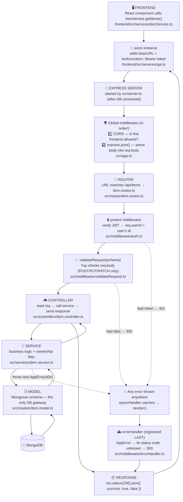

# 📘 The Backend Guide — Learn It Once, Use It Forever

This backend is a **blueprint**. Every file follows one repeating pattern, so once
you understand the Items example, you can build ANY backend by copying it and
swapping the business logic — like solving new math problems with one model sum.

**How to read this guide:** top to bottom the first time. After that, jump using
the table of contents — and keep the code open beside it. Every file in
`backend/src/` starts with the same header so you always know where you are:

```
📄 WHAT : what this file is
🎯 WHY  : why this layer exists
🔁 FLOW : previous step ➜ THIS FILE ➜ next step
```

---

## Table of contents

1. [How the web works in 60 seconds](#1-how-the-web-works-in-60-seconds)
2. [The 5 HTTP verbs](#2-the-5-http-verbs--get-post-put-patch-delete)
3. [🗺️ The Master Flowchart](#3-%EF%B8%8F-the-master-flowchart)
4. [The folder map — which file do I open?](#4-the-folder-map--which-file-do-i-open)
5. [The principles behind the structure](#5-the-principles-behind-the-structure)
6. [Security — the parts you must never skip](#6-security--the-parts-you-must-never-skip)
7. [Recipe cards — copy-paste steps](#7-recipe-cards--copy-paste-steps)
8. [Interview Q&A bank](#8-interview-qa-bank)

---

## 1. How the web works in 60 seconds

- Your **frontend** (React, in the browser) and your **backend** (Express, on a
  server) are two separate programs, possibly on two different machines.
- They talk over **HTTP**: the frontend sends a **request**, the backend sends
  back a **response**. That's the entire relationship.
- A request has: a **verb** (GET/POST/…), a **URL** (`/api/items/42`), optional
  **headers** (e.g. the login token) and an optional **body** (JSON data).
- A response has: a **status code** (200, 404, 500…) and usually a JSON body.
- Why does the frontend need a backend at all? Because the browser can't be
  trusted and can't be shared: the **database, secrets and rules** must live on
  a machine you control. The frontend is the *face*; the backend is the *law*.

**Our response envelope** (every endpoint, always the same shape):

```json
{ "success": true,  "data": { ... } }        // when it worked
{ "success": false, "message": "why" }        // when it didn't
```

One consistent shape = the frontend never guesses what came back.

---

## 2. The 5 HTTP verbs — GET, POST, PUT, PATCH, DELETE

Think of the backend as a shop storeroom and each verb as one thing you can ask
the storekeeper to do.

| Verb | Meaning | Analogy | Body? | Success code |
|------|----------|---------|-------|--------------|
| **GET** | *read* data | "Show me the shelf" | no | 200 |
| **POST** | *create* new data | "Add this new box" | yes | 201 |
| **PUT** | *replace* existing data | "Swap the box with this new one" | yes | 200 |
| **PATCH** | *partially update* | "Just change the label on that box" | yes | 200 |
| **DELETE** | *remove* data | "Throw that box away" | no | 200 |

### What ACTUALLY happens when a GET runs (step by step)

```
1. Frontend:  itemService.getItems()  →  axios sends:  GET /api/items
              (api.ts automatically adds:  Authorization: Bearer <token>)
2. Express receives it, walks through app.ts top-to-bottom: CORS → JSON parser
3. URL matches app.use('/api/items') → enters routes/item.routes.ts
4. protect middleware verifies the JWT → sets req.userId
5. router.get('/') matches → asyncHandler(getItems) runs the controller
6. Controller calls itemService.getItems(req.userId)
7. Service asks the model:  Item.find({ owner })  → MongoDB returns documents
8. Controller sends:  200  { success: true, data: [ ...items ] }
9. Frontend axios resolves → React setState → the list appears on screen
```

Every other verb is the SAME journey with two differences: POST/PUT/PATCH carry
a body (which `validateRequest` checks at step 5), and the service performs a
different DB operation (`create`, `findOneAndUpdate`, `findOneAndDelete`).

### PUT vs PATCH (favourite interview question)

- **PUT** = "here is the FULL new version of this resource" — conceptually a replacement.
- **PATCH** = "change ONLY the fields I'm sending" — e.g. `{ "quantity": 5 }`.
- In this codebase both share one service function and one validation schema
  (see `item.controller.ts` — that's DRY), but the routes expose both verbs so
  clients can express their intent correctly.

### The status codes you'll actually use

| Code | Name | When |
|------|------|------|
| 200 | OK | successful read/update/delete |
| 201 | Created | successful POST |
| 400 | Bad Request | validation failed |
| 401 | Unauthorized | no/invalid token — "who are you?" |
| 403 | Forbidden | valid user, but not allowed — "I know you, but no" |
| 404 | Not Found | resource doesn't exist (or isn't yours) |
| 409 | Conflict | duplicate (email already registered) |
| 500 | Server Error | our bug — the errorHandler's fallback |

---

## 3. 🗺️ The Master Flowchart

Every request through this backend takes this exact path. Learn it ONCE:



**Why each hand-off happens (the "why", not just the "how"):**

| Hand-off | Why it goes there next |
|---|---|
| route ➜ `protect` | identity first — don't waste work on anonymous requests |
| `protect` ➜ `validateRequest` | now check the DATA — reject garbage before logic runs |
| `validateRequest` ➜ controller | data is clean; controller can trust `req.body` |
| controller ➜ service | controller speaks HTTP; the service speaks BUSINESS. Separating them means the logic is reusable and testable without a fake browser |
| service ➜ model | only models touch the DB; swap MongoDB later and controllers never notice |
| any throw ➜ errorHandler | ONE place turns errors into responses — no try/catch scattered everywhere |

---

## 4. The folder map — which file do I open?

```
backend/
├── .env                  ← your real secrets (NEVER committed)
├── .env.example          ← template of the secrets (committed)
├── package.json          ← dependencies + npm scripts
├── tsconfig.json         ← TypeScript compiler rules
└── src/
    ├── server.ts         ← START HERE: connect DB, then listen
    ├── app.ts            ← global middleware + one line per resource
    ├── config/           ← env loading + DB connection (setup, not features)
    ├── routes/           ← WHICH urls exist            (1 file / resource)
    ├── middleware/       ← checks BETWEEN route & controller (auth, validation, errors)
    ├── controllers/      ← HTTP in, HTTP out — 3 lines each (1 file / resource)
    ├── services/         ← the real logic + DB calls    (1 file / resource)
    ├── models/           ← Mongoose schemas             (1 file / resource)
    ├── validations/      ← Yup rules for request bodies (1 file / resource)
    ├── types/            ← TypeScript interfaces        (1 file / resource)
    └── utils/            ← small shared helpers (AppError, asyncHandler, generateToken)
```

**"I want to… → open…" cheat table:**

| I want to… | Open… |
|---|---|
| add a new URL/endpoint | `routes/<resource>.routes.ts` (+1 line) |
| change what an endpoint does | `services/<resource>.service.ts` |
| change what input is allowed | `validations/<resource>.validation.ts` |
| add/change a DB field | `models/<X>.model.ts` **and** `types/<x>.types.ts` |
| create a whole new resource | copy all 6 `item.*` files → rename (see recipe below) |
| change error responses | `middleware/errorHandler.ts` |
| protect / unprotect a route | add/remove `protect` in the routes file |
| add an env variable | `.env`, `.env.example`, and `config/env.ts` |

---

## 5. The principles behind the structure

These are the WHY behind every folder. Interviewers love these; more
importantly, they're why this codebase stays clean as it grows.

### SRP — Single Responsibility Principle
> Every file has exactly ONE job.

The controller only translates HTTP. The service only does logic. The model only
talks to the DB. **Test:** describe a file's job in one sentence without "and".
`item.controller.ts` = "turns HTTP requests into service calls." ✅

### DRY — Don't Repeat Yourself
> If you write it twice, extract it.

Live examples here: `asyncHandler` (one error-catcher instead of try/catch in
every controller) · `validateRequest` (one validator runner) · `generateToken`
(register AND login use it) · one `updateItemSchema` serving PUT **and** PATCH ·
the `{ success, data }` envelope everywhere.

### KISS — Keep It Simple, Stupid
> The simplest thing that works, until you truly need more.

Controllers are 3 lines. No classes, no clever abstractions, no libraries we
don't need. Complexity must be *earned* by a real requirement.

### Modular Monolith
> ONE deployable app, organised into feature modules.

`auth.*` files and `item.*` files are separate *modules* (easy to find, easy to
delete) but deploy as ONE server. This is the right architecture for 95% of
projects. **Microservices** (each module its own server + own DB) solve scaling
problems you don't have yet — know the term, don't start there.

### Dependency Injection (the lightweight idea)
> A file shouldn't secretly reach out for what it needs — dependencies flow IN.

The service doesn't read `process.env` or a global "current user" — the
controller **passes** `req.userId` in as a parameter, and config comes in
through the imported `env` object (one swappable source). This is DI thinking
without a framework: functions receive what they need, which makes them easy to
test — call `getItems('someUserId')` directly, no fake HTTP required.

### Coupling & Decoupling
> Coupling = how much one file KNOWS about another. Less = better.

The controller doesn't know Mongoose exists. The service doesn't know Express
exists (it throws `AppError`, never touches `res`). The frontend only knows the
`{ success, data }` contract. Result: you can swap MongoDB→PostgreSQL by
rewriting models/services only, and the controllers/routes/frontend never
notice. That freedom is exactly what decoupling buys.

---

## 6. Security — the parts you must never skip

### Hashing vs encryption (know the difference cold)
- **Encryption is two-way**: lock with a key 🔑, unlock with a key. Right for
  data you must read back (HTTPS traffic).
- **Hashing is one-way**: password → `$2b$10$N9qo8uLO…` and there is NO way
  back. Right for passwords — even the database admin can't read them.
- Login never "decrypts": `bcrypt.compare()` hashes what you typed and checks
  whether the two hashes match (`auth.service.ts`).
- bcrypt also **salts** (random extra data per user) — two users with the same
  password get different hashes — and is deliberately **slow**, which ruins
  brute-force attacks.

### JWT — how "being logged in" works with no session
A JWT is three base64 parts: `header.payload.signature`.
The payload (your user id) is readable by anyone — but the **signature** is
computed with `JWT_SECRET`, so nobody can forge or edit a token without it.
Login issues the token (`generateToken.ts`) → the frontend sends it on every
request → `protect` verifies it. The server stores NOTHING (stateless).
Tokens carry an expiry (`7d`) so a stolen token doesn't work forever.

### Environment variables — secrets never live in code
- Real secrets → `.env` (gitignored). Template → `.env.example` (committed).
- Code reads them ONLY through `config/env.ts`, which **crashes at startup** if
  a required one is missing (fail fast — better than a 2am production surprise).
- ⚠️ Committed a secret even once? It lives in git history forever — **rotate
  it** (new DB password, new JWT secret). Deleting the file is not enough.

### The rest of the checklist (all implemented here)
| Defence | Where | One-liner |
|---|---|---|
| CORS whitelist | `app.ts` | only OUR frontend may call this API |
| Input validation | `validations/` + `validateRequest` | reject garbage before logic; `stripUnknown` blocks field-injection |
| Ownership filter | `item.service.ts` | every query filtered by `owner` — users can't touch others' data even by guessing ids |
| Generic auth errors | `auth.service.ts` | "Invalid email or password" — never reveal which was wrong |
| Hidden hash | `User.model.ts` | `select: false` keeps the hash out of every query by default |
| No leaked stack traces | `errorHandler.ts` | unknown errors → generic 500; details go to the terminal only |

---

## 7. Recipe cards — copy-paste steps

### 🧾 Recipe: a brand-new resource (e.g. "Product")
The Items module is your model sum. Copy its 6 files, rename, done:

| # | Create | Copy from | Change |
|---|---|---|---|
| 1 | `types/product.types.ts` | `item.types.ts` | fields |
| 2 | `models/Product.model.ts` | `Item.model.ts` | schema fields |
| 3 | `validations/product.validation.ts` | `item.validation.ts` | rules |
| 4 | `services/product.service.ts` | `item.service.ts` | logic |
| 5 | `controllers/product.controller.ts` | `item.controller.ts` | names only |
| 6 | `routes/product.routes.ts` | `item.routes.ts` | names only |
| 7 | in `app.ts` add | — | `app.use('/api/products', productRoutes);` |

Frontend twin: copy `services/itemService.ts` + the `pages/Items/` folder the
same way, then add one `<Route>` and one nav entry.

### 🧾 Recipe: one extra endpoint on an existing resource
Example: `GET /api/items/stats`.
1. **Service** — add `getStats(owner)` with the logic.
2. **Controller** — add the 3-line `getStats` function.
3. **Route** — `router.get('/stats', asyncHandler(itemController.getStats));`
   ⚠️ put it ABOVE `router.get('/:id')` — otherwise "stats" is captured as an `:id`!
4. Body-carrying endpoint? Also add a schema + `validateRequest(schema)`.

### 🧾 The unbreakable patterns (memorise these three shapes)

```ts
// CONTROLLER — always 3 steps
export async function doThing(req: Request, res: Response) {
  const input = req.body;                                  // 1. read request
  const result = await thingService.doThing(input, req.userId!); // 2. call service
  res.status(200).json({ success: true, data: result });   // 3. respond
}

// SERVICE — logic + ownership + typed errors
export async function doThing(input: ThingInput, owner: string) {
  const thing = await Thing.findOne({ _id: input.id, owner });
  if (!thing) throw new AppError('Thing not found', 404);
  return thing;
}

// ROUTE — one readable line per endpoint
router.post('/', validateRequest(createThingSchema), asyncHandler(thingController.createThing));
```

---

## 8. Interview Q&A bank

**HTTP & REST**
- *GET vs POST?* GET reads (no body, cacheable); POST creates (body, 201).
- *PUT vs PATCH?* PUT replaces the whole resource; PATCH changes only sent fields.
- *What is idempotent?* Same request repeated = same result. GET/PUT/DELETE are;
  POST isn't (two POSTs = two items).
- *What is REST?* URLs name resources (`/items/42`), verbs name the action.

**Express**
- *What is middleware?* A function that runs between request and response;
  `(req,res,next)` — call `next()` to pass the request onward.
- *Why is errorHandler last?* Express runs the stack in order; errors are passed
  DOWN to the next error middleware, so the catcher sits at the bottom.
- *How does Express recognize an error handler?* By its 4-argument signature.
- *Why asyncHandler?* Express 4 doesn't auto-catch async errors — an unhandled
  rejection would hang the request.

**Security**
- *Hashing vs encryption?* One-way vs two-way; passwords are hashed, never encrypted.
- *What is a salt?* Random per-user data mixed into the hash — same passwords,
  different hashes; rainbow tables defeated.
- *What's in a JWT? Can users read it?* header.payload.signature; yes, the
  payload is readable — but not editable without the secret. Never put secrets
  in the payload.
- *Where do JWT sessions live on the server?* Nowhere — stateless by design.
- *Why validate on the backend when the frontend validates?* Client checks are
  UX; server checks are security. Anyone can bypass a browser with curl.
- *Why "Invalid email or password" instead of the exact error?* Don't help
  attackers enumerate registered emails.

**Architecture**
- *Why controller AND service?* SRP + testability: HTTP translation vs business
  logic; services are reusable from scripts/jobs and testable without HTTP.
- *Monolith vs microservices?* One deployable vs many; start with a modular
  monolith, split only when a real scaling need appears.
- *What is coupling?* How much one part knows about another's internals. This
  repo decouples layers so any one of them can be replaced alone.
- *What is dependency injection?* Dependencies are passed IN (parameters,
  config objects) rather than grabbed from globals — swap and test freely.

---

*Companion file: [README.md](README.md) for setup. Frontend patterns (services,
props drilling, protected routes) live in `frontend/src` — start at
`pages/Items/ItemsPage.tsx`, which mirrors this backend's Items module.*
