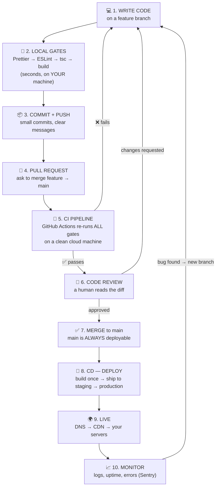
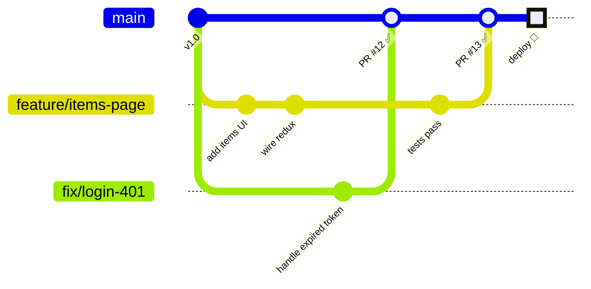
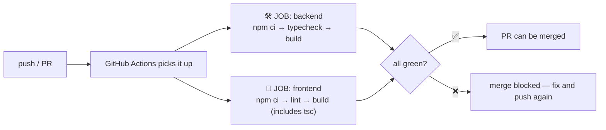
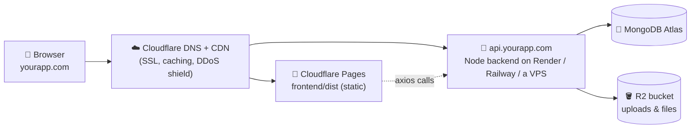
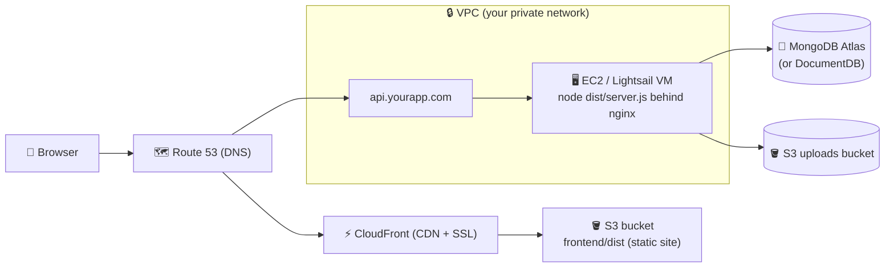

# 🚀 The DevOps Guide — From Your Keyboard to the World

Companion to [BACKEND-GUIDE.md](BACKEND-GUIDE.md) and [FRONTEND-GUIDE.md](FRONTEND-GUIDE.md).
Those teach you to WRITE the app. This one teaches everything AROUND the code:
how it stays clean, how it travels from your laptop to a server, and how real
teams ship without breaking things.

DevOps is not a tool — it's the **assembly line** your code rides on. Learn the
line once, and every future project (any stack) uses the same blueprint.

---

## Table of contents

1. [🗺️ The Big Picture — the journey of one line of code](#1-%EF%B8%8F-the-big-picture)
2. [The four local quality gates](#2-the-four-local-quality-gates)
3. [Git branching — how teams work without chaos](#3-git-branching--how-teams-work-without-chaos)
4. [The PR flow & code reviews](#4-the-pr-flow--code-reviews)
5. [CI — the robot that checks every push](#5-ci--the-robot-that-checks-every-push)
6. [CD & environments — dev, staging, production](#6-cd--environments)
7. [What actually gets deployed?](#7-what-actually-gets-deployed)
8. [Cloud architecture A — the Cloudflare path](#8-cloud-architecture-a--the-cloudflare-path)
9. [Cloud architecture B — the AWS path](#9-cloud-architecture-b--the-aws-path)
10. [DNS in 5 minutes](#10-dns-in-5-minutes)
11. [Cost optimization — the mentor's rules](#11-cost-optimization)
12. [Monitoring — after the deploy](#12-monitoring--after-the-deploy)
13. [📋 The blueprint checklist for ANY new project](#13-the-blueprint-checklist)
14. [Interview Q&A bank](#14-interview-qa-bank)

---

## 1. 🗺️ The Big Picture

This is the whole subject in one diagram. Everything below explains one box.



**The one rule that explains everything:** `main` must ALWAYS be deployable.
Every practice below — branches, PRs, CI, reviews — exists to protect that rule.

---

## 2. The four local quality gates

Run these BEFORE you push, in this order. Each catches a different class of
problem, cheapest first:

| # | Gate | Command (this repo) | Catches |
|---|------|--------------------|---------|
| 1 | **Formatting** — Prettier | `npm run format` | style noise (spacing, quotes) so reviews discuss LOGIC, never style |
| 2 | **Linting** — ESLint | `npm run lint` (frontend) | suspicious code: unused vars, broken hook rules, likely bugs |
| 3 | **Type check** — tsc | `npm run typecheck` | wrong shapes: passing a string where a number goes, missing fields |
| 4 | **Build** | `npm run build` | "it compiles on my machine" — proven, not assumed |

💡 Formatting vs linting (classic interview question): a formatter rewrites how
code LOOKS (no behavior change); a linter flags what code DOES (possible bugs).
Prettier formats, ESLint lints — you want both.

Teams automate these as a **pre-commit hook** (tool: *husky* + *lint-staged*)
so the gates literally cannot be forgotten. CI (section 5) then repeats them on
a neutral machine — belt AND braces.

---

## 3. Git branching — how teams work without chaos

**Never commit directly to `main`.** Every piece of work gets its own short-lived
branch, and merges back through a PR:



**The strategy to learn first: GitHub Flow** (what this diagram shows):
1. `main` is protected and always deployable.
2. New work → branch off `main`: `feature/items-page`, `fix/login-401`.
3. Push early, open a PR, let CI + review run.
4. Merge (squash), delete the branch, deploy.

Branch naming convention — the name tells the story:

```
feature/<what>     feature/infinite-scroll
fix/<what>         fix/login-401-loop
chore/<what>       chore/upgrade-vite      (tooling, no behavior change)
docs/<what>        docs/api-guide
```

Rules of thumb:
- **One branch = one purpose.** A branch mixing a feature + an unrelated fix
  is two branches pretending to be one.
- **Short-lived** — merge within days, not weeks. Long branches rot: `main`
  moves on and you inherit merge conflicts.
- Sync often: `git pull origin main` into your branch daily.
- 💡 "Git Flow" (develop/release/hotfix branches) exists for versioned,
  scheduled releases; for web apps that deploy continuously, GitHub Flow is
  the modern default. Know both names.

---

## 4. The PR flow & code reviews

A **Pull Request** = "I want to merge my branch into main — please check it."
It's the quality checkpoint where robots AND humans inspect the change.

The etiquette that makes reviews work:

**As the author**
- Keep PRs SMALL (aim < ~400 changed lines). Small PRs get real reviews;
  1000-line PRs get a tired "LGTM 👍".
- Fill the description: WHAT changed, WHY, HOW you tested it
  (this repo ships a template — `.github/pull_request_template.md`).
- Never merge on red CI. Fix it or explain it.

**As the reviewer** — check, in order:
1. **Correctness** — does it do what the description says? Edge cases?
2. **Pattern-fit** — does it follow the repo's blueprint (the WHAT/WHY/FLOW
   layers, thunks-not-fetch-in-components, service layer…)?
3. **Security** — secrets in code? unvalidated input? data leaks in responses?
4. **Simplicity** — could this be smaller/clearer? (comment, don't rewrite)

Comments are about the CODE, never the coder: *"this loop re-fetches on every
render — move it into the thunk?"* beats *"you did this wrong."*

**Merge style:** prefer **Squash & merge** — your 12 messy WIP commits become
ONE clean commit on main. History stays readable: one commit ≈ one PR ≈ one change.

---

## 5. CI — the robot that checks every push

**Continuous Integration** = a cloud machine that runs your quality gates on
EVERY push and PR, from a clean checkout. It kills "works on my machine" —
because it's never your machine.

This repo has a real pipeline: [`.github/workflows/ci.yml`](.github/workflows/ci.yml).
What it does:



The concepts inside the YAML (read the file — every line is commented):

| Concept | Meaning |
|---|---|
| `on:` | WHEN to run — pushes and PRs targeting `main` |
| `jobs:` | independent machines; backend & frontend run **in parallel** |
| `runs-on: ubuntu-latest` | a fresh throwaway Linux VM per job |
| `npm ci` | clean install EXACTLY from package-lock.json (never `npm install` in CI — reproducibility) |
| cache | keeps `node_modules` downloads warm between runs → fast pipelines |
| **secrets** | passwords/tokens live in repo *Settings → Secrets*, injected as env vars — NEVER in the YAML |

Then in GitHub: *Settings → Branches → protect `main`* → require the CI checks
to pass + one review before merging. Now the "always deployable" rule is
enforced by the platform, not by trust.

---

## 6. CD & environments

**Continuous Deployment/Delivery** = after merge, the pipeline SHIPS the build.
No SSH-ing into servers and copying files by hand — the pipeline does the same
steps every time, so deploys are boring (boring = good).

Real projects run **three environments**:

```
dev (your laptop)  ➜  staging (a private clone of prod)  ➜  production (users)
```

| Environment | Who uses it | Database | Purpose |
|---|---|---|---|
| dev | you | local/dev DB | build & break freely |
| staging | your team | its OWN DB (fake data) | rehearse the deploy, test like a user |
| production | the world | the real DB | the money maker |

Iron rules:
- **Same build artifact** moves dev → staging → prod. You promote the EXACT
  bytes you tested — only the env vars change (that's why all config lives in
  `.env` / injected variables, never in code — see the other guides).
- **Staging and prod never share a database.**
- A deploy you can't UNDO is a trap: keep the previous build around so
  "rollback" = point back at it (one command / one click).

---

## 7. What actually gets deployed?

Beginners' biggest confusion. Your MERN app is **three different things** that
deploy three different ways:

| Piece | What it becomes | How it's served |
|---|---|---|
| Frontend (`frontend/`) | `npm run build` → `dist/` = **static files** (HTML/CSS/JS) | any static host / CDN — no Node server needed! |
| Backend (`backend/`) | a **long-running Node process** (`node dist/server.js`) | a machine or platform that keeps a process alive |
| Database | you DON'T deploy it — you rent it **managed** | MongoDB Atlas (already doing this ✅) |

Once you see this split, every cloud menu makes sense: you're shopping for
(1) a static-file host, (2) a process-runner, (3) managed data. That's it.

---

## 8. Cloud architecture A — the Cloudflare path

The modern low-cost stack. Cloudflare started as a CDN + DNS layer and now
hosts apps too:

| Service | What it is | Use it for |
|---|---|---|
| **DNS + CDN** | your domain's phonebook + 300 city-edge cache | every project, free tier |
| **Pages** | static hosting with git-push deploys | your `frontend/dist` |
| **Workers** | tiny JS functions at the edge (serverless) | APIs — but note: our Express+Mongoose backend needs a Node host; Workers suit new, lightweight APIs |
| **R2** | object storage, **S3-compatible API** | user uploads, images, backups |

💡 **R2's superpower — zero egress fees.** S3 charges ~$0.09/GB every time a
file is DOWNLOADED (egress). R2 charges $0 for that. A media-heavy app
(images/video served constantly) can be 10x cheaper on R2. Because the API is
S3-compatible, the same SDK code works on both.



**Beginner's first production stack (mentor's pick):** Cloudflare DNS+Pages
(free) + backend on a simple Node platform or small VPS (~$5) + Atlas free
tier + R2 (free tier). Real domain, SSL, CDN — for the price of a coffee.

---

## 9. Cloud architecture B — the AWS path

AWS is the industry giant — more power, more knobs, more ways to overspend.
The services you named, demystified:

| Service | What it is | When to use it |
|---|---|---|
| **S3** | object storage — files in "buckets" via API. Also hosts static sites | frontend `dist/` (with CloudFront), uploads, backups |
| **CloudFront** | AWS's CDN — caches S3/your server worldwide + gives SSL | in front of S3 for the frontend |
| **EC2** | a raw virtual machine — full control, YOU manage node/nginx/updates/scaling | when you need full control or custom software |
| **Lightsail** | EC2's beginner bundle: fixed price (~$5/mo), VM + IP + DNS in one | ⭐ your first backend server — predictable bill |
| **VPC** | your private network inside AWS: subnets, routing, firewalls | you get a default one; design it when systems grow |
| **Route 53** | AWS's DNS service | domains/records if you're all-in on AWS |
| **IAM** | users/roles/permissions for AWS itself | day one: never use the root account for daily work |

The classic architecture for THIS repo's app on AWS:



**VPC in one breath:** public subnet = things the internet may reach (the web
server); private subnet = things it must NOT reach (databases). Security groups
are per-machine firewalls: "allow 443 from everyone, 22 only from my IP."
That sentence is 80% of VPC interviews.

**Cloudflare vs AWS — which?** Portfolio/startup/simple SaaS → Cloudflare path:
simpler, near-free. Enterprise scale, deep service needs (queues, ML, big
private networks) → AWS. Learning both names on this map is the real win: every
other cloud (GCP, Azure) sells the same shapes with different labels.

---

## 10. DNS in 5 minutes

DNS = the internet's phonebook: names → addresses.

What happens when someone opens `yourapp.com`:

```
1. Browser asks DNS: "yourapp.com = which IP?"
2. Your domain's NAMESERVERS answer (set at your registrar → e.g. Cloudflare)
3. The zone's RECORDS resolve it:
     A      yourapp.com      → 203.0.113.7      (name → IP)
     CNAME  www.yourapp.com  → yourapp.com      (alias → name)
     CNAME  api.yourapp.com  → your-host.onrender.com
4. Browser connects to that IP over HTTPS (SSL cert proves identity —
   free via Cloudflare or Let's Encrypt)
```

- **TTL** = how long answers may be cached. Lower it (300s) before a planned
  migration, raise it after.
- Subdomains are free organization: `api.`, `staging.`, `admin.` — each can
  point somewhere different.
- 💡 DNS changes are not instant — caches worldwide honor the old TTL
  ("propagation"). That's why it "works on your phone but not your laptop."

---

## 11. Cost optimization

The mentor's rules, in priority order:

1. **Free tiers first.** Cloudflare Pages, Atlas M0, R2 10GB, GitHub Actions
   minutes — a full professional stack for $0–5/mo. Don't build on EC2 "to be
   ready for scale" you don't have.
2. **Fixed-price before elastic.** Lightsail's flat $5 can't surprise you; raw
   EC2 + traffic + storage can. Graduate to elastic pricing when you actually
   need elasticity.
3. **Watch EGRESS.** Data going OUT is the classic surprise bill (S3 ~$0.09/GB).
   Media-heavy? R2's zero egress or a CDN cache in front.
4. **Kill idle. ** Dev/staging machines running nights & weekends are ~70% waste —
   stop them on a schedule.
5. **Set a billing alarm on day one.** AWS Budgets / Cloudflare notifications:
   alert at $5. A mail at $5 beats a shock at $500.
6. **Right-size by measurement.** Check real CPU/RAM after 2 weeks; most first
   servers are 4x oversized.

| This repo's stack | Free-tier route | Small-prod route |
|---|---|---|
| Frontend | Cloudflare Pages $0 | S3+CloudFront ~$1–3 |
| Backend | Render/Railway free-ish | Lightsail $5 / EC2 t3.small ~$15 |
| MongoDB | Atlas M0 $0 | Atlas M10 ~$9 |
| Files | R2 $0 (10GB) | R2/S3 a few $ |
| DNS+SSL+CDN | Cloudflare $0 | Cloudflare $0 |
| **Total** | **≈ $0** | **≈ $15–30/mo** |

---

## 12. Monitoring — after the deploy

Deploying isn't the finish line — knowing it WORKS is.

- **Health endpoint** — this backend already ships `GET /api/health`. An uptime
  monitor (UptimeRobot, free) pings it every minute and emails you when it dies.
- **Error tracking** — Sentry catches exceptions in prod (frontend + backend)
  with stack traces and the request that caused them. Free tier; add it before
  users find your bugs for you.
- **Logs** — on a VPS: `pm2 logs` (pm2 also restarts a crashed Node app and
  should run your backend in prod); on platforms: built-in log tabs.
- **The golden signals** (name them in interviews): latency, traffic, errors,
  saturation — is it slow, busy, failing, or full?

---

## 13. 📋 The blueprint checklist

Every new project, any stack — walk this list top to bottom:

```
REPO SETUP (day one)
□ git init + push to GitHub, main branch protected
□ Prettier + ESLint + typecheck + build scripts wired  (Gates 1–4)
□ .env.example committed, real .env gitignored
□ CI workflow: lint + typecheck + build on every PR
□ PR template + branch naming convention agreed

EVERY FEATURE (the loop)
□ branch: feature/<name>  →  code  →  local gates pass
□ push → PR → CI green → review → squash-merge → delete branch

FIRST DEPLOY
□ frontend → static host (Cloudflare Pages / S3+CloudFront)
□ backend  → process host (Lightsail/EC2 + pm2, or Render/Railway)
□ database → managed (Atlas), IP access + strong user, own DB per env
□ domain   → DNS records (A/CNAME), HTTPS everywhere
□ env vars set per environment — nothing secret in the repo, ever

PRODUCTION HYGIENE
□ staging environment rehearses every deploy
□ health check + uptime monitor + Sentry
□ billing alarm set; idle machines stopped
□ rollback tested once ON PURPOSE (before you need it in anger)
```

---

## 14. Interview Q&A bank

**Quality & git**
- *Formatter vs linter?* Formatter rewrites style (Prettier); linter flags
  likely bugs (ESLint). No overlap, use both.
- *`npm ci` vs `npm install`?* `ci` installs exactly from the lockfile
  (reproducible, used in CI); `install` may update the lockfile.
- *What is GitHub Flow?* Protected main + short-lived branches + PRs + deploy
  from main. Git Flow adds develop/release/hotfix branches for versioned releases.
- *Squash merge?* Collapse a branch's commits into one clean commit on main.

**CI/CD**
- *CI vs CD?* CI verifies every change (build+tests on neutral machines);
  CD ships verified changes automatically (Delivery = auto to staging + manual
  prod approve; Deployment = auto all the way).
- *Where do secrets live in CI?* Encrypted repo/org secrets injected as env
  vars at runtime — never in the YAML, never in code.
- *Why did CI fail when it works locally?* Lockfile drift, node version drift,
  case-sensitive imports (Linux!), or a missing env var — in that order of likelihood.

**Cloud**
- *S3 vs EC2?* Storage service (files via API) vs a virtual machine (compute).
  Different categories, not competitors.
- *Why Lightsail over EC2 for beginners?* Fixed price, batteries included;
  same VM idea without the billing surprises.
- *What is a VPC?* Your private network in the cloud: public subnets for
  web-facing things, private subnets for databases, security groups as firewalls.
- *Why is R2 cheaper than S3 for media?* Zero egress fees — S3 bills per GB
  downloaded, R2 doesn't; the API is S3-compatible so code barely changes.
- *A record vs CNAME?* Name→IP vs name→another-name (alias).
- *What is a CDN?* Cached copies of your static content in hundreds of cities —
  users hit the nearest copy; origin only serves misses.

---

*The three guides together: [BACKEND-GUIDE.md](BACKEND-GUIDE.md) — build the API ·
[FRONTEND-GUIDE.md](FRONTEND-GUIDE.md) — build the UI · this guide — ship both.*
