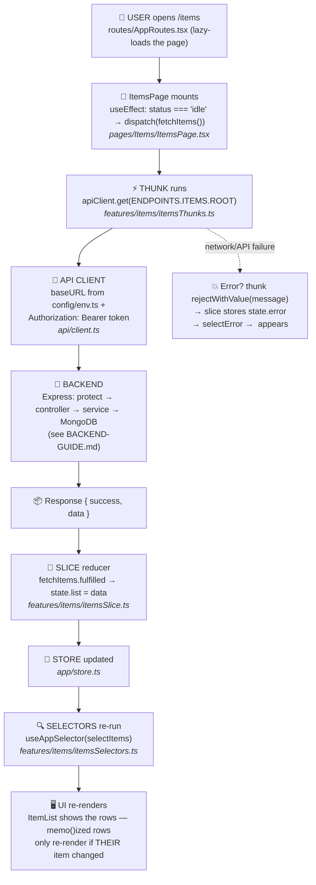

# 📗 The Frontend Guide — React + Redux, Learn It Once, Use It Forever

This frontend is a **blueprint**. Every feature follows ONE identical pattern —
once you understand the Items feature, you can build any React app by copying it
and swapping the business logic. Companion to [BACKEND-GUIDE.md](BACKEND-GUIDE.md).

Every file starts with the same header, so you always know where you are:

```
📄 WHAT : what this file is
🎯 WHY  : why this layer exists
🔁 FLOW : previous step ➜ THIS FILE ➜ next step
```

---

## Table of contents

1. [The Golden Rules](#1-the-golden-rules)
2. [🗺️ The Master Flow — UI ➜ Redux ➜ API ➜ backend ➜ back](#2-%EF%B8%8F-the-master-flow)
3. [The folder map — which file do I open?](#3-the-folder-map--which-file-do-i-open)
4. [Redux for beginners — the 5 words](#4-redux-for-beginners--the-5-words)
5. [The API pipeline — env ➜ endpoints ➜ client ➜ thunk ➜ slice ➜ selector](#5-the-api-pipeline)
6. [Recipe cards — copy-paste steps](#6-recipe-cards--copy-paste-steps)
7. [Performance playbook](#7-performance-playbook)
8. [SCSS conventions](#8-scss-conventions)
9. [Interview Q&A bank](#9-interview-qa-bank)

---

## 1. The Golden Rules

These rules make every project you build look the same — clean, predictable,
maintainable. Break one only when you can explain why.

| # | Rule | Where it's enforced here |
|---|------|--------------------------|
| 1 | **No API calls in components.** Components dispatch thunks; only `api/client.ts` talks to the network | every component |
| 2 | **API endpoints live in ONE file** (`api/endpoints.ts`), base URL in env config | `api/`, `config/env.ts` |
| 3 | **Server data lives in Redux**, never copied into `useState` | slices + selectors |
| 4 | **Local `useState` is ONLY for pure UI state** (open/closed, show password, form drafts) | LoginForm, ItemForm |
| 5 | **UI reads via selectors** (`useAppSelector(selectItems)`), **writes via dispatch** | every page |
| 6 | **Routes are navigation only** — no logic, no fetching inside the route table | `routes/AppRoutes.tsx` |
| 7 | **One component = one `.scss` file** next to it (BEM-ish class names) | every component |
| 8 | **Files stay small** — target < 500 lines; split when a file grows two jobs | everywhere |
| 9 | **Memoize deliberately**: `React.memo` on list rows/leaf components, `useCallback` for handlers passed down, `useMemo` for expensive computations | ItemList, ItemForm |
| 10 | **One request at a time** per user action; parallel calls only when truly independent | thunks + `status` flag |
| 11 | **Clean URLs** (`/dashboard`), filters/tabs handled via state — not query-param soup | routes + view state |
| 12 | **No localStorage for app state.** Exception: the JWT (must survive refresh); everything else re-fetches via API | `authSlice` only |
| 13 | **No `setTimeout` to "fix" timing.** If you need one, something upstream is wrong | — |
| 14 | **Stable libraries only** — no beta/experimental deps in a real project | package.json |
| 15 | **Prettier formats everything** (`npm run format`); TypeScript everywhere, `camelCase` names, `PascalCase` components | `.prettierrc` |
| 16 | **StrictMode stays ON** — it exposes unsafe effects in dev | `main.tsx` |

---

## 2. 🗺️ The Master Flow

How data moves when you open the Items page — learn this ONCE, it never changes:



**Why each hand-off happens:**

| Hand-off | Why |
|---|---|
| component ➜ thunk | the component shouldn't know HOW data is fetched — only that it wants it (decoupling; swap REST for anything later, UI unchanged) |
| thunk ➜ api client | ONE axios instance owns baseURL/token/401-handling — thunks never repeat it (DRY) |
| response ➜ slice | ONE place decides how state changes → predictable, debuggable (Redux DevTools shows every action) |
| slice ➜ selector ➜ UI | components never touch store internals; if the shape changes, only selectors change |

The same flow in reverse for writes: `dispatch(createItem(payload))` ➜ thunk POSTs
➜ backend saves ➜ `fulfilled` ➜ slice `unshift`s the new item ➜ selectors ➜ the
list updates. **No refetch needed** — the slice updates the list surgically.

---

## 3. The folder map — which file do I open?

```
frontend/src/
├── main.tsx              # entry: <Provider store> + <ColorModeProvider>
├── App.tsx               # Router wrapper
├── config/
│   └── env.ts            # STEP 1 — reads VITE_* env vars (base URL)
├── api/
│   ├── endpoints.ts      # STEP 2 — every endpoint path, one file
│   └── client.ts         # STEP 3 — the one axios instance (+ token, 401)
├── app/
│   ├── store.ts          # the Redux store — register each feature's reducer
│   └── hooks.ts          # typed useAppDispatch / useAppSelector
├── features/             # ⭐ one folder per feature = the app's brain
│   ├── auth/             #   authTypes / authThunks / authSlice / authSelectors
│   └── items/            #   itemsTypes / itemsThunks / itemsSlice / itemsSelectors
├── routes/AppRoutes.tsx  # navigation ONLY (lazy pages + RequireAuth)
├── layouts/MainLayout/   # AppBar + Sidebar + content shell
├── components/           # shared presentational components (PageHeader)
├── pages/                # one folder per screen; each component + its .scss
│   ├── Auth/             #   login / register / forgot (full-screen)
│   └── Items/            #   ⭐ the example CRUD page (copy this)
├── styles/               # _variables.scss + main.scss (global only)
└── theme/                # MUI theme + light/dark mode context
```

**"I want to… → open…" cheat table:**

| I want to… | Open… |
|---|---|
| call a NEW backend endpoint | `api/endpoints.ts` (+1 line) → add a thunk in the feature |
| change how state updates after a call | `features/<name>/<name>Slice.ts` |
| read state in a component | the feature's `…Selectors.ts` + `useAppSelector` |
| add a whole new feature | copy `features/items/` + `pages/Items/` → rename |
| add a page/URL | `routes/AppRoutes.tsx` (+lazy import +1 Route) + `layouts/MainLayout/navItems.ts` |
| restyle a component | its own `.scss` file, right next to it |
| change the API base URL | `.env` → `VITE_API_URL` (then restart `npm run dev`) |

---

## 4. Redux for beginners — the 5 words

Think of Redux as the app's **shared brain**:

- **Store** — one big object holding all shared state (`state.auth`, `state.items`). One per app.
- **Slice** — one feature's part of the store + the ONLY functions allowed to change it.
- **Thunk** — an action that runs async code (our API calls). Automatically emits `pending / fulfilled / rejected`.
- **Dispatch** — how the UI *asks* for a change: `dispatch(fetchItems())`. Components never edit state directly.
- **Selector** — how the UI *reads* state: `useAppSelector(selectItems)`. The component re-renders automatically when that slice of state changes.

Why not just `useState` everywhere? Because server data (items, user) is needed
by MANY components, must survive navigation, and changes in well-defined ways.
One brain = no duplicated fetches, no props drilling through five layers, and
Redux DevTools shows you every action that ever changed the state — debugging
becomes reading a timeline.

💬 INTERVIEW: "When do you use local state vs Redux?" — local for pure UI state
(a toggle, a draft input), Redux for anything shared, server-derived, or needed
after navigation. That's rule #3/#4 above.

---

## 5. The API pipeline

Every endpoint the backend gives you travels these 6 stops. **Never skip a stop.**

```
.env                    VITE_API_URL=http://localhost:5000/api
  ↓
config/env.ts           env.API_URL  (the only file reading import.meta.env)
  ↓
api/endpoints.ts        ENDPOINTS.ITEMS.ROOT = '/items'
  ↓
api/client.ts           apiClient = axios.create({ baseURL: env.API_URL })
  ↓
features/items/itemsThunks.ts     fetchItems = createAsyncThunk(...)
  ↓
features/items/itemsSlice.ts      .addCase(fetchItems.fulfilled, …)
  ↓
features/items/itemsSelectors.ts  selectItems
  ↓
pages/Items/ItemsPage.tsx         useAppSelector(selectItems) + dispatch(fetchItems())
```

### The 5 verb templates (already implemented — copy them)

All five live in [`itemsThunks.ts`](frontend/src/features/items/itemsThunks.ts) —
GET (`fetchItems`), POST (`createItem`), PUT (`updateItem`), PATCH (`patchItem`),
DELETE (`deleteItem`). Every one is the SAME shape:

```ts
export const doThing = createAsyncThunk<ReturnType, PayloadType, { rejectValue: string }>(
  'feature/doThing',
  async (payload, { rejectWithValue }) => {
    try {
      const res = await apiClient.post<ApiEnvelope<ReturnType>>(ENDPOINTS.FEATURE.PATH, payload);
      return res.data.data;
    } catch (error) {
      return rejectWithValue(getErrorMessage(error, 'Readable fallback message.'));
    }
  }
);
```

And every slice handles it with the SAME three cases:

```ts
.addCase(doThing.pending,   (state) => { state.status = 'loading'; state.error = null; })
.addCase(doThing.fulfilled, (state, action) => { state.status = 'succeeded'; /* apply action.payload */ })
.addCase(doThing.rejected,  (state, action) => { state.status = 'failed'; state.error = action.payload ?? '…'; })
```

And every component consumes it the SAME way:

```tsx
const dispatch = useAppDispatch();
const items   = useAppSelector(selectItems);      // READ
const loading = useAppSelector(selectItemsLoading);
// WRITE:
const result = await dispatch(createItem(payload));
if (createItem.fulfilled.match(result)) { /* success-only UI step, e.g. clear form */ }
```

---

## 6. Recipe cards — copy-paste steps

### 🧾 Recipe: a brand-new feature (e.g. "Products")

| # | Create | Copy from | Change |
|---|---|---|---|
| 1 | endpoint lines in `api/endpoints.ts` | `ITEMS` block | paths |
| 2 | `features/products/productsTypes.ts` | `itemsTypes.ts` | fields |
| 3 | `features/products/productsThunks.ts` | `itemsThunks.ts` | names + endpoints + types |
| 4 | `features/products/productsSlice.ts` | `itemsSlice.ts` | names |
| 5 | `features/products/productsSelectors.ts` | `itemsSelectors.ts` | names |
| 6 | register in `app/store.ts` | — | `products: productsReducer` (1 line) |
| 7 | `pages/Products/` (+ each component's `.scss`) | `pages/Items/` | UI |
| 8 | route + nav entry | — | 1 line each |

Backend twin: the same table exists in [BACKEND-GUIDE.md](BACKEND-GUIDE.md) —
build the API there first, then run this recipe.

### 🧾 Recipe: infinite scroll / pagination (same architecture)

1. Backend: `GET /items?page=2&limit=20` returns `{ data, hasMore }`.
2. `itemsTypes.ts`: add `page` and `hasMore` to the state.
3. `fetchItems` thunk takes `{ page }` and calls `ENDPOINTS.ITEMS.ROOT + params`.
4. Slice: `fulfilled` **appends** (`state.list.push(...)`) instead of replacing, and stores `hasMore`.
5. UI: an `IntersectionObserver` on a sentinel `<div>` at the list's end dispatches
   `fetchItems({ page: page + 1 })` when visible **and** `hasMore && !loading`.
6. Huge lists? Render with `react-window` so only visible rows exist in the DOM.

Notice: nothing new architecturally — same env ➜ endpoint ➜ thunk ➜ slice ➜ selector pipeline.

### 🧾 Recipe: a protected page

Add the `<Route>` INSIDE the `RequireAuth` block in `AppRoutes.tsx` — done.
The guard reads `selectIsLoggedIn` from Redux; pages never check auth themselves.

---

## 7. Performance playbook

Work through this list IN ORDER when the app feels slow (or CPU/GPU > ~60%):

1. **Remove console.logs** — logging large objects every render is real work.
2. **Find unnecessary re-renders** (React DevTools Profiler): then
   - `React.memo` leaf components (see `ItemRow` — editing one row re-renders ONE row);
   - `useCallback` for handlers passed to memo'd children;
   - `useMemo` for expensive computed values;
   - select the SMALLEST state a component needs (`selectItemsLoading`, not the whole state).
3. **Code-split** with `React.lazy` + `<Suspense>` — already done per page in `AppRoutes.tsx`.
4. **Virtualize long lists** (`react-window`) — render only the visible rows.
5. **Paginate / infinite-scroll** instead of fetching thousands of records (recipe above).
6. **Don't fetch what you have** — the `status === 'idle'` guard in ItemsPage makes Redux the cache.
7. **Monitor in production** — a tool like Sentry reports real users' errors and slowdowns.
8. Keep **StrictMode** on in dev; it surfaces the bugs that cause redundant work.

💬 INTERVIEW: "How do you stop a list re-rendering every row on one change?" —
memo the row component and make sure only the changed row gets a new object
reference (exactly what our slice's `map` replacement does).

---

## 8. SCSS conventions

- **One component = one `.scss` file**, same name, same folder, imported at the top of the component.
- **BEM-ish naming**: `.item-form`, `.item-form__row`, `.auth-page__glow--top` — block, `__element`, `--modifier`.
- **Design tokens** in `styles/_variables.scss` (`@use '../../styles/variables' as *;`) — change a brand color once.
- **Global CSS** (`styles/main.scss`) holds ONLY resets + layout CSS variables — never component styles.
- **MUI boundary**: theme-dependent styling (light/dark, `theme.transitions`) stays in the MUI theme / `sx`;
  static custom styling goes to SCSS. When overriding MUI internals from SCSS
  (`.MuiOutlinedInput-root`…), higher specificity or `!important` is sometimes
  required — that's expected, keep it commented (see `AuthPage.scss`).
- Media queries live in the component's own SCSS (see `BrandPanel.scss`) — mobile-first thinking.

---

## 9. Interview Q&A bank

**React**
- *Controlled vs uncontrolled inputs?* Controlled = value lives in state (`value` + `onChange`), which is what we use.
- *What does `React.memo` do?* Skips re-render when props are shallow-equal. Pair with `useCallback` or the props defeat it.
- *`useMemo` vs `useCallback`?* Memoize a VALUE vs memoize a FUNCTION.
- *What is code-splitting?* `React.lazy(() => import(...))` — each page's JS downloads on first visit.
- *Why StrictMode?* Double-invokes render/effects in dev to expose unsafe patterns early.

**Redux**
- *Why Redux over Context for server data?* Purpose-built: DevTools timeline, middleware (thunks), memoized selectors, predictable updates. Context re-renders every consumer on any change.
- *What is a thunk?* An action creator that returns async logic; RTK wires its lifecycle actions automatically.
- *Can a reducer call an API?* Never — reducers must be pure. Async work lives in thunks.
- *What is `rejectWithValue`?* Lets a failed thunk carry a typed, readable error into `action.payload`.
- *Why selectors instead of `state.items.list` inline?* One place knows the shape → refactors don't break components.

**Architecture**
- *Where do API calls live?* Thunks only — never components, never routes. One axios instance handles auth/401 centrally.
- *localStorage for state?* No — Redux + refetch. Sole exception: the JWT, which must survive refresh.
- *How is the token attached to requests?* Axios request interceptor in `api/client.ts` — written once, applied everywhere.
- *What happens on 401?* Response interceptor clears the token and redirects to /login — the app "auto-logs-out" safely.

---

*Setup steps live in [README.md](README.md). The backend's matching guide is
[BACKEND-GUIDE.md](BACKEND-GUIDE.md) — read the two flowcharts together and you
can trace a keypress all the way to MongoDB and back.*
