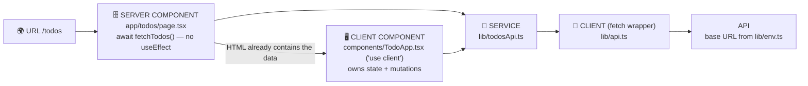

# ▲ Next.js + TypeScript Template (App Router)

The framework template: **file-based routing**, **server components** for data,
**client components** for interactivity — same methodology as the other templates.

```bash
npm install && npm run dev     # runs instantly against the free demo API
```

## The flow



## Folder map

```
src/
├── app/                    # FILE-BASED ROUTING: folder = URL, page.tsx = the page
│   ├── layout.tsx          # html/body shell + globals (like index.html + main.tsx)
│   ├── globals.scss        # resets + design tokens (CSS variables)
│   ├── page.tsx            # "/"
│   └── todos/page.tsx      # "/todos" — SERVER component, awaits data
├── components/             # client components + their *.module.scss
│   ├── TodoApp.tsx         # 'use client' — hooks, events, mutations
│   └── TodoApp.module.scss # CSS Module: class names auto-scoped
└── lib/                    # the shared pipeline (works on server AND client)
    ├── env.ts              # STEP 1 — reads NEXT_PUBLIC_* env vars
    ├── endpoints.ts        # STEP 2 — every path, one file
    ├── api.ts              # STEP 3 — the one fetch wrapper
    └── todosApi.ts         # STEP 4 — one function per API call
```

## The Next.js-specific lessons

1. **No route table** — `app/todos/page.tsx` IS the `/todos` route.
2. **Server components (default)**: async, `await` data directly, ship zero JS,
   but no hooks/events. **Client components** (`'use client'`): hooks + events.
   Pattern: *fetch on the server, interact on the client.*
3. **fetch, not axios** — native fetch works in both runtimes, and Next extends
   it with caching (`cache: 'no-store'` vs `next: { revalidate: 60 }`).
4. **CSS Modules** (`*.module.scss`) = one scoped stylesheet per component.
5. `.env.local` for secrets; only `NEXT_PUBLIC_*` values reach the browser.
6. ⚠️ This template pins **TypeScript 5.x** — Next.js's type-checking still
   needs the classic TS compiler API (TypeScript 7's native compiler isn't
   supported by Next yet).

## Swap in your own business logic

1. `.env.local`: point `NEXT_PUBLIC_API_URL` at your backend.
2. `lib/endpoints.ts`: your resource's paths.
3. Copy `lib/todosApi.ts` → your resource's functions.
4. New page = new folder under `app/` (server component that awaits data)
   + a client component for its interactivity.
