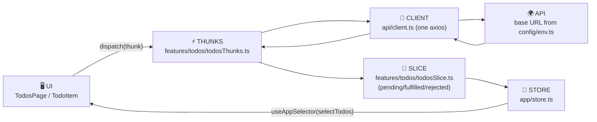

# 🟣 React + Redux + TypeScript Template

State management with **Redux Toolkit**: thunks → slice → selectors. The starter
version of the pattern the main EMC [`frontend/`](../../frontend/) uses at full
scale (auth, guards, MUI) — see [FRONTEND-GUIDE.md](../../FRONTEND-GUIDE.md).

```bash
npm install && npm run dev     # runs instantly against the free demo API
```

## The flow



## Folder map

```
src/
├── main.tsx                 # entry: <Provider store> wraps <App>
├── App.tsx                  # root (Router goes here in bigger apps)
├── config/env.ts            # STEP 1 — reads VITE_* env vars
├── api/
│   ├── endpoints.ts         # STEP 2 — every path, one file
│   └── client.ts            # STEP 3 — the one axios instance
├── app/
│   ├── store.ts             # the store — register each feature's reducer
│   └── hooks.ts             # typed useAppDispatch / useAppSelector
├── features/todos/          # ⭐ STEP 4 — THE 4-FILE FEATURE PATTERN
│   ├── todosTypes.ts        #   shapes
│   ├── todosThunks.ts       #   API calls (GET/POST/PATCH/DELETE templates)
│   ├── todosSlice.ts        #   how state changes
│   └── todosSelectors.ts    #   how the UI reads state
├── components/              # leaf components (memo'd) + their .scss
├── pages/                   # pages + their .scss
└── styles/                  # _variables.scss + main.scss (global resets only)
```

## The rules this template enforces

1. Components never call APIs — they `dispatch(thunk)`.
2. UI reads state ONLY via selectors (`useAppSelector(selectTodos)`).
3. Endpoints in one file; base URL from env; axios configured once.
4. Local `useState` only for pure-UI state (the input draft).
5. One component = one `.scss` beside it; tokens in `_variables.scss`.
6. `React.memo` on rows; the slice replaces only the changed item.
7. The `status === 'idle'` guard makes Redux the cache — no double fetches.

## Swap in your own business logic

1. `.env`: point `VITE_API_URL` at your backend.
2. `api/endpoints.ts`: describe your resource's paths.
3. Copy `features/todos/` → `features/<yourResource>/` (4 files, rename).
4. Register the reducer in `app/store.ts` (1 line).
5. Copy the page + components → your UI.

Compare with [`react-ts`](../react-ts/) (same app, no Redux) to see exactly
what Redux buys you — and what it costs.
