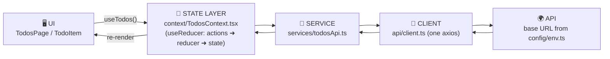

# ⚛️ React + TypeScript Template (no Redux)

State management with **Context + `useReducer`** and a clean **service layer** —
the standard pattern when you don't need Redux. Zero extra state libraries.

```bash
npm install && npm run dev     # runs instantly against the free demo API
```

## The flow



## Folder map

```
src/
├── main.tsx               # entry: <TodosProvider> wraps <App>
├── App.tsx                # root (Router goes here in bigger apps)
├── config/env.ts          # STEP 1 — reads VITE_* env vars
├── api/
│   ├── endpoints.ts       # STEP 2 — every path, one file
│   └── client.ts          # STEP 3 — the one axios instance
├── services/todosApi.ts   # STEP 4 — one function per API call
├── context/TodosContext.tsx # STEP 5 — reducer + provider + useTodos()
├── components/            # leaf components (memo'd) + their .scss
├── pages/                 # one folder-mate .scss per page
└── styles/                # _variables.scss + main.scss (global resets only)
```

## The rules this template enforces

1. Components never call APIs — they call `useTodos()` actions.
2. The reducer is pure: actions in, new state out, no side effects.
3. Endpoints in one file; base URL from env; axios configured once.
4. Local `useState` only for pure-UI state (the input draft).
5. One component = one `.scss` beside it; tokens in `_variables.scss`.
6. `React.memo` on list rows + `useCallback` on shared handlers.

## Swap in your own business logic

1. `.env`: point `VITE_API_URL` at your backend.
2. `api/endpoints.ts`: describe your resource's paths.
3. Copy `services/todosApi.ts` → your resource's functions (same 4 templates).
4. Copy `context/TodosContext.tsx` → your resource's state/actions/reducer.
5. Copy the page + components → your UI.

When shared state grows past ~2–3 contexts or you want DevTools time-travel,
graduate to Redux — the repo's main [`frontend/`](../../frontend/) is the full
Redux reference (same methodology; the context is replaced by
thunks/slice/selectors — see [FRONTEND-GUIDE.md](../../FRONTEND-GUIDE.md)).
